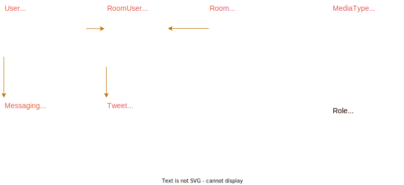

<p align="center">
  
</p>
<h1 align="center">SpaceMoon</h1>

A Step by step guide on how to create and publish Flutter Firebase app to Google play store and Apple app store.

## How to build

```dart
flutterfire configure
dart run build_runner watch --delete-conflicting-outputs
flutter pub upgrade

Generate Flutter l10n
  flutter gen-l10n

For local emulator cloud function, configure appcheck debug token in Firebase console.
For android local emulator, change computerIp in firebase.dart to your computer ip address.

Running Cloud function:
  firebase emulators:start

Building Cloud Functions
  cd functions
  npm run build:watch

Generating Proto files
  cd proto
  npx buf generate lib
```

## Features

- [x] [Firebase Auth : Email, Google, Apple](./docs/steps/Auth.md)
- [x] [Protocol Buffers](https://protobuf.dev/)
- [x] [Deep linking](./docs/steps/DeepLinking.md)
- [x] [Firebase Messaging](./docs/steps/FirebaseMessaging.md)
- [x] [Firebase Crashlytics](https://firebase.google.com/docs/crashlytics)

### Packages

- [x] [Riverpod](https://pub.dev/packages/flutter_riverpod)
- [x] [Gorouter](https://pub.dev/packages/go_router)

### Firebase

- [x] [Firebase Cloud Functions](https://pub.dev/packages/cloud_functions)
- [x] [Firebase App Check](https://pub.dev/packages/firebase_app_check)
- [x] [Firebase Cloud Firestore](https://pub.dev/packages/cloud_firestore)
- [x] [Firebase Auth](https://pub.dev/packages/firebase_auth)
- [x] [Firebase Messaging](https://pub.dev/packages/firebase_messaging)
- [x] [Firebase Storage](https://pub.dev/packages/firebase_storage)
- [x] [Firebase Crashlytics](https://pub.dev/packages/firebase_crashlytics)

### Helper

- [x] [App Flowy](https://pub.dev/packages/appflowy_editor)
- [x] [Flutter Animate](https://pub.dev/packages/flutter_animate)
- [x] [Video Player](https://pub.dev/packages/video_player)
- [x] [Mobile Scanner](https://pub.dev/packages/mobile_scanner)

## [Schema](proto/lib/data.proto)



## Cloud Functions

### Auth User

- [x] Create User : [onUserCreate](functions/src/users.ts#10)
- [x] Update User : [callUserUpdate](functions/src/users.ts#L35)
- [x] Delete User : [deleteAuthUser](functions/src/users.ts#L67)

### Messaging

- [x] Tweet to Topic : [tweetToTopic](functions/src/messaging.ts#L108)
- [x] Save FCM Token : [callFCMtokenUpdate](functions/src/messaging.ts#L183)
- [x] Subscribe to Topic : [callSubscribeFromTopic](functions/src/messaging.ts#L54)
- [x] Unsubscribe to Topic : [callUnsubscribeFromTopic](functions/src/messaging.ts#L42)
- [x] Toggle Topic Subsription : [toggleTopicSubsription](functions/src/messaging.ts#L66)
- [x] Update FCM Token : [callFCMtokenUpdate](functions/src/messaging.ts#L183)
- [x] Delete FCM Token : [deleteFCMToken](functions/src/messaging.ts#L177 )
- [x] Schedule Prune Tokens : [pruneTokens](functions/src/messaging.ts#L211)

## Getting Started

### Step 1 : [Creating Project and Configuring Firebase](./docs/steps/Create.md)

### Step 2  : [App Check : Protect your APIs](./docs/steps/AppCheck.md)

### Step 3 : [State Management with Riverpod](./docs/steps/StateManagement.md)

### Step  : [Creating Apple Certificates, Identifiers & Profiles](./docs/steps/AppleAppStore.md)

### Step  : [Playstore](./docs/steps/GooglePlayStore.md)

### Step  : [Deployment](./docs/steps/Deployment.md)

### Step  : [Cli Cheat Sheet](./docs/steps/CliCheatSheet.md)
