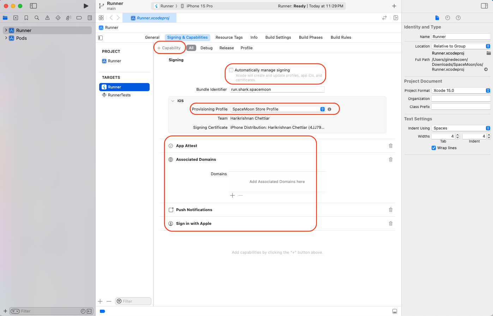

# Creating Apple Certificates, Identifiers & Profiles

  Create Apple Developer account and enroll @ [https://developer.apple.com/programs/enroll/](https://developer.apple.com/programs/enroll/)

  [https://developer.apple.com/support/certificates/](https://developer.apple.com/support/certificates/)

## Create Developer ID certificates

* [Create a certificate signing request](https://developer.apple.com/help/account/create-certificates/create-a-certificate-signing-request)
* [Create Developer ID certificates](https://developer.apple.com/help/account/create-certificates/create-developer-id-certificates)

## Creating Identifier

* [Register an App ID](https://developer.apple.com/help/account/manage-identifiers/register-an-app-id)

## [Enable app capabilities](https://developer.apple.com/help/account/reference/supported-capabilities-ios)

* [App Attest](https://developer.apple.com/documentation/devicecheck/establishing_your_app_s_integrity)
* [Associated Domains](https://developer.apple.com/documentation/xcode/configuring-an-associated-domain) : For [Universal Links](https://developer.apple.com/ios/universal-links/)
* [Push Notifications](https://developer.apple.com/help/account/manage-identifiers/enable-app-capabilities#enable-push-notifications)
* [Sign In with Apple](https://developer.apple.com/help/account/configure-app-capabilities/about-sign-in-with-apple)

## Register a New Provisioning Profile

[Create an App Store provisioning profile](https://developer.apple.com/help/account/manage-provisioning-profiles/create-an-app-store-provisioning-profile)

* Type Distribution: App Store
Create a distribution provisioning profile to submit your app to the App Store.
* Select App ID
* Select Certificate
* Download and save profile, do not share.
* Copy the profile in ~/Library/MobileDevice/Provisioning Profiles/

## XCode Setup

* Disable automatically manage singing
* select provisioning profile
* Add Capabilities in XCode

## Create App in AppStoreConnect

## More Links

[https://developer.apple.com/help/account/](https://developer.apple.com/help/account/)

[https://developer.apple.com/support/](https://developer.apple.com/support/)

[https://developer.apple.com/help/app-store-connect/](https://developer.apple.com/help/app-store-connect/)

[Certificate Signing Requests Explained](https://developer.apple.com/forums/thread/699268)

[How to code sign & publish iOS apps](https://blog.codemagic.io/how-to-code-sign-publish-ios-apps/)
