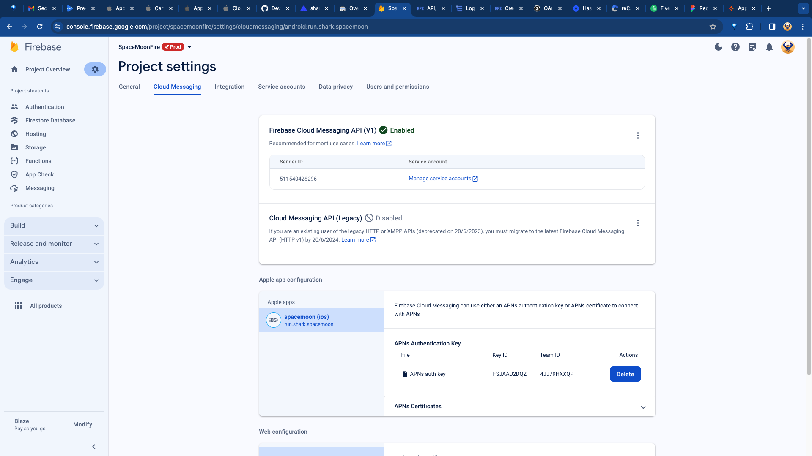
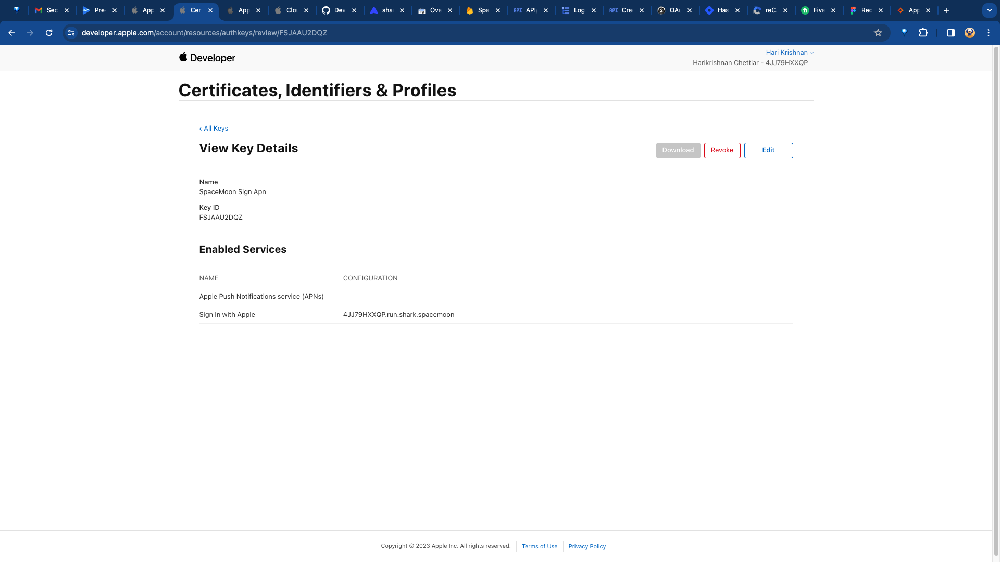
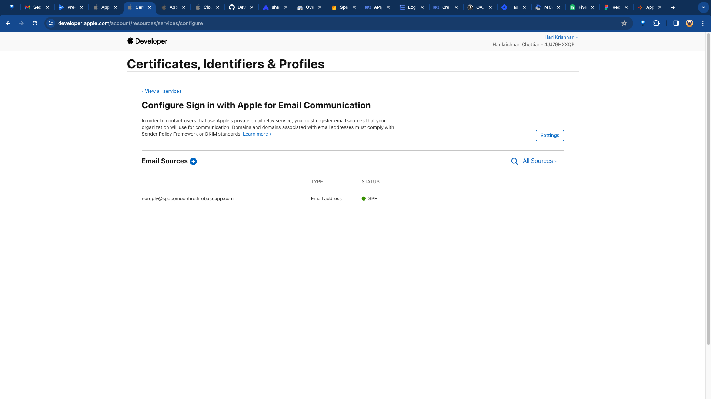
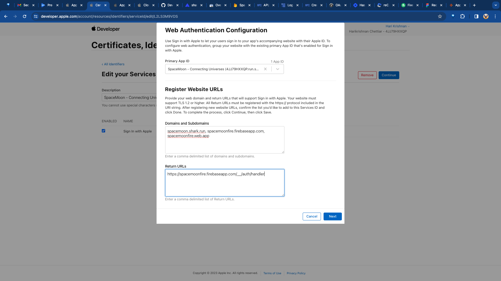
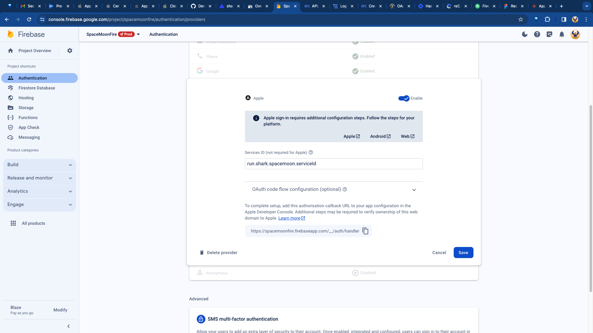
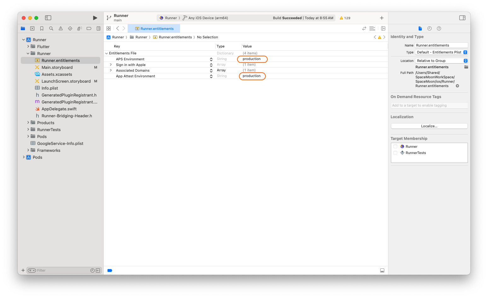

# [firebase_messaging](https://pub.dev/packages/firebase_messaging)

## [Play Store Requirements](https://firebase.google.com/docs/cloud-messaging/flutter/client#platform-specific_setup_and_requirements)

```code
flutter pub add firebase_messaging
```

[Managing Cloud Messaging Tokens](https://firebase.blog/posts/2023/04/managing-cloud-messaging-tokens/)

[Best practices for FCM registration token management](https://firebase.google.com/docs/cloud-messaging/manage-tokens)

[Firebase Cloud Messaging](https://firebase.flutter.dev/docs/messaging/overview/)

[Set up a Firebase Cloud Messaging client app on Flutter](https://firebase.google.com/docs/cloud-messaging/flutter/client)

[Receive messages in a Flutter app](https://firebase.google.com/docs/cloud-messaging/flutter/receive)

[](https://www.youtube.com/watch?v=P51dI2y7QHA)

[Build app server send requests](https://firebase.google.com/docs/cloud-messaging/send-message)

[Notifications](https://firebase.flutter.dev/docs/messaging/notifications)

[News Toolkit](https://flutter.github.io/news_toolkit/flutter_development/push_notifications/)







